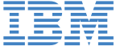

# Awards

## Best paper award

To motivate and reward excellent research contributions within the scope of the workshop, we will hand out an award for the best paper.

## Travel awards

We are pleased to financially support attendance of young talented researchers that are eager to attend the TRL workshop at NeurIPS 2022 in New Orleans but have limited access to financial resources and/or belong to historically marginalized groups. Applications are due 15 October 2022.

<iframe src="https://docs.google.com/forms/d/e/1FAIpQLSexmHcGx8XU7Ilas_MpLV4QF5rWLw5LIWLMnlXZCn-VhEpEoQ/viewform?embedded=true" width="640" height="560"></iframe>.

# Sponsors
We are grateful to the sponsors who make these awards possible:

 
 

 
 

 
 
