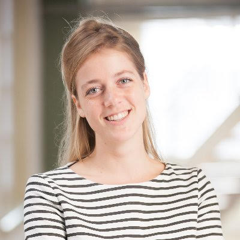
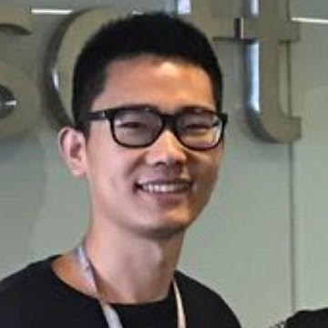
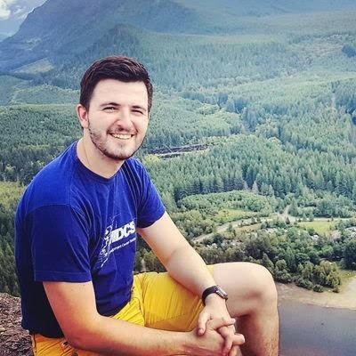
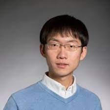

# Organization

## Organizing Committee

<table border="0" style="border:none; border-collapse:collapse; cellspacing:0; cellpadding:0" >
    <tr style="border:none"  align="left">
      <td style="border:none" width="33%"></td>
      <td style="border:none" width="33%"></td>
      <td style="border:none" width="33%"></td>
    </tr>
    <tr style="border:none" align="left">
      <td style="border:none" bgcolor="white">
      <a href="https://madelonhulsebos.github.io/" target="blank">Madelon Hulsebos University of Amsterdam / Sigma Computing</a></td>
      <td style="border:none" bgcolor="white"><a href="https://www.microsoft.com/en-us/research/people/hadong" target="blank">Haoyu Dong Microsoft Research Asia</a></td>
      <td style="border:none" bgcolor="white"><a href="https://bojan.ninja/" target="blank">Bojan Karlas ETH Zurich</a></td>
    </tr>
    <tr style="border:none" align="left">
      <td style="border:none" width="33%"></td>
      <td style="border:none" width="33%"></td>
    </tr>
    <tr style="border:none" align="left">
      <td style="border:none" bgcolor="white"><a href="https://cs.stanford.edu/people/lorr1" target="blank">Laurel Orr Stanford</a></td>
      <td style="border:none" bgcolor="white"><a href="https://pcyin.me/" target="blank">Pengcheng Yin Google Research</a></td>
    </tr>
</table>

## Program Committee

- Paul Groth (University of Amsterdam)
- Sebastian Schelter (University of Amsterdam)
- Çağatay Demiralp (Sigma Computing)
- Vraj Shah (IBM)
- Vasilis Efthymiou (FORTH-ICS/University of Crete)
- Benjamin Hilprecht (TU Darmstadt)
- Matteo Interlandi (Microsoft)
- Cedrig Renggli (University of Zurich)
- Merve Gurel (ETH Zurich)
- Beliz Gunel (Stanford)
- Mengyu Zhou (Microsoft)
- Yan Gao (Microsoft)
- Bei Chen (Microsoft)
- Zhiruo Wang (CMU)
- Zhoujun Cheng (STJU)
- Simran Arora (Stanford)
- Qingping Yang (CAS)
- Vadim Borisov (University of Tübingen)
- Susie Rao (ETH Zurich)
- Till Döhmen (University of Amsterdam)
- Alexandra Savelieva (Microsoft, UC Berkeley)
- Henry Gouk (University of Edinburgh)
- Linyong Yan (Yale)
- Qian Liu (Sea AI Lab)
- Shuo Zhang (Bloomberg L.P.)
- Surabhi Bhargava (Adobe)
- José Pablo Cambronero (Microsoft)
- Kavitha Srinivas (IBM)
- Hiroshi Iida (Sony Corporation)
- Juan Sequeda (data.world)
- Andreas Kipf (Amazon)
- Paolo Papotti (EURECOM)
- Peng Shi (University of Waterloo)
- Wenhu Chen (University of Waterloo)
- Tianji Cong (University of Michigan)

<!-- Please fill in the form below if you are interested and available to review for the TRL Workshop 2022:
<iframe src="https://docs.google.com/forms/d/e/1FAIpQLSehwvK6eJHT0y9XTpN0yusAR5sRFoBipfBdQChH2Xkh6dYdnA/viewform?embedded=true" width="640" height="760"></iframe>. -->
