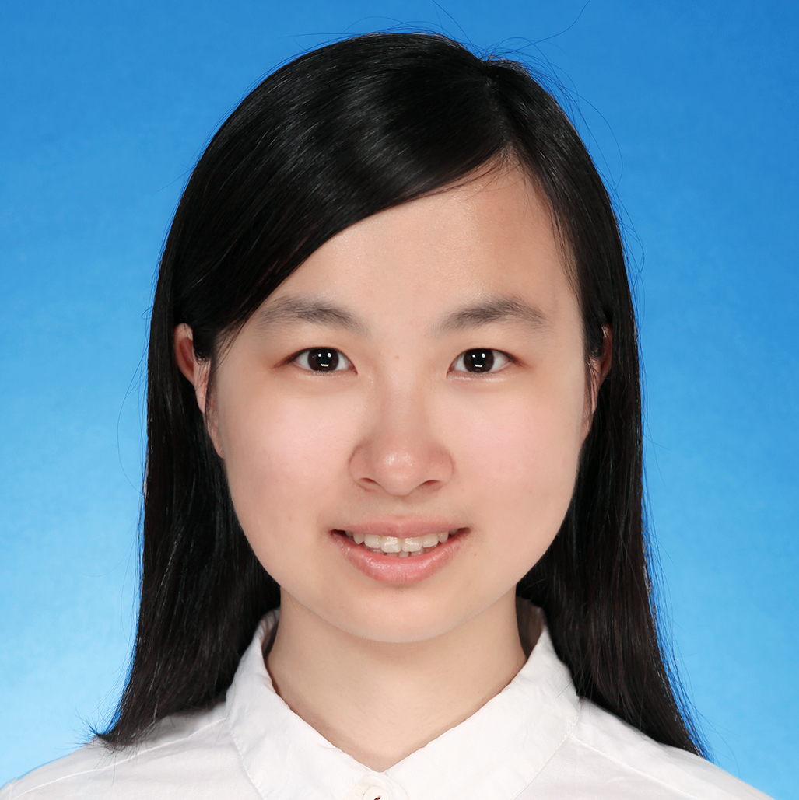
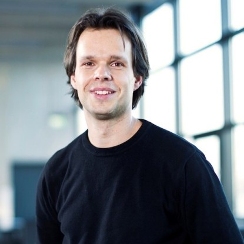
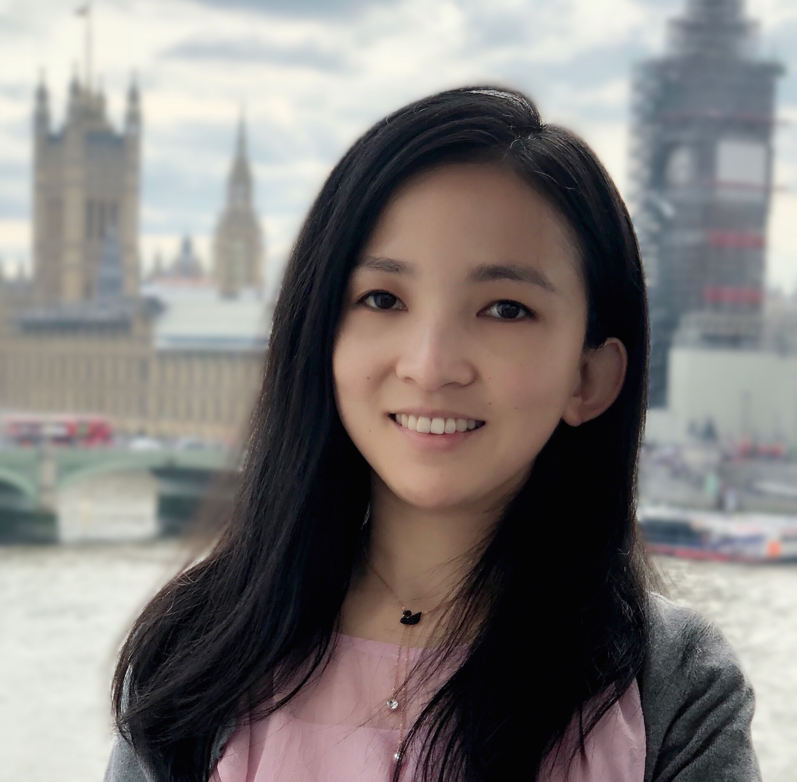
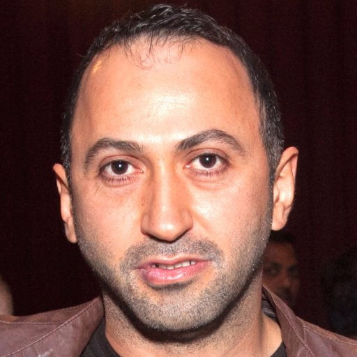

# Program

The workshop will be hosted physically in New Orleans. Authors of accepted papers are expected to present their work in-person. While we welcome all other attendees to join us in New Orleans as well, it is also possible to attend the program virtually as the sessions will be live-streamed.

## Speakers
<!-- We are pleased to host the following speakers:
<a href="https://ai.facebook.com/people/alon-halevy/" target="blank">Alon Halevy (keynote)</a>, Meta AI
    

Bio

        Alon Halevy has been a Director at Facebook AI since August 2019. He works on Affective Computing and on data management for artificial intelligence, including the combination of neural and symbolic techniques for data management. Prior to Facebook, he was the CEO of Megagon Labs (2015-2018) and led the Structured Data Research Group at Google Research (2005-2015), where they developed WebTables and Google Fusion Tables. From 1998-2005 he was a professor at the University of Washington, where he founded the database group. Before that, he was at AT&T Bell Labs (and AT&T Labs) (1993-1997). He founded two startups, Nimble Technology and Transformic Inc. (acquired by Google in 2005). He received his Ph.D in Computer Science from Stanford in 1993 and his Bachelors in Computer Science and Mathematics from the Hebrew University of Jerusalem in 1988. He has authored two books: The Infinite Emotions of Coffee (December, 2011) and Principles of Data Integration (with AnHai Doan and Zack Ives, published in 2012). He is a Fellow of the ACM and a recipient of the PECASE Award and Sloan Fellowship. He and his co-authors received VLDB 10-year Best Paper Awards for their 2008 paper on WebTables and for their 1996 paper on the Information Manifold Data Integration System.
    

<a href="http://www.phontron.com/" target="blank">Graham Neubig (keynote)</a>, Carnegie Mellon University
    

Bio

    Graham Neubig is an associate professor at the Language Technologies Institute of Carnegie Mellon University. His research focuses on multilingual natural language processing, natural language interfaces to computers, and machine learning methods for NLP, with the final goal of every person in the world being able to communicate with each-other, and with computers in their own language. He also contributes to making NLP research more accessible through open publishing of research papers, advanced NLP course materials and video lectures, and open-source software, all of which are available on his web site.
    

<a href="https://www.informatik.tu-darmstadt.de/datamanagement/datamanagement/index.en.jsp" target="blank">Carsten Binnig</a>, TU Darmstadt
    

Bio

    Carsten Binnig is a Full Professor in the Computer Science department at at TU Darmstadt and an Adjunct Associate Professor in the Computer Science department at Brown University. Carsten received his PhD at the University of Heidelberg in 2008. Afterwards, he spent time as a postdoctoral researcher in the Systems Group at ETH Zurich and at SAP working on in-memory databases. Currently, his research focus is on the design of scalable data management systems, databases and modern hardware as well as machine learning for scalable systems. His work has been awarded with a Google Faculty Award, as well as multiple best paper and best demo awards for his research.
    

<a href="https://www.microsoft.com/en-us/research/people/beichen/" target="blank">Bei Chen</a>, Microsoft Research
    

Bio

    Bei Chen (陈蓓) is a senior researcher at Microsoft Research Asia. She joined Microsoft in 2017 after receiving her Ph.D. degree from Department of Computer Science and Technology in Tsinghua University. Her research interests are primarily on machine learning and its applications in natural language processing and data mining, especially latent feature models, probabilistic graphical models, Bayesian nonparametrics, reinforcement learning and deep learning.
    

<a href="https://hci.stanford.edu/~cagatay/" target="blank">Çağatay Demiralp</a>, Sigma Computing
    

Bio

    Çağatay is Chief Research Scientist at Sigma Computing. Previously, he was a senior research scientist at Megagon Labs, a visiting researcher with the data systems group at MIT CSAIL, and a research staff member at IBM Research. Between 2012-2014, he was a postdoctoral scholar at Stanford and member of IDL at the University of Washington. Çağatay obtained his PhD from Brown University and also co-founded Fitnescity, a startup providing easy access and data analytics for wellness lab tests.
    His current research focuses on solving problems at the intersection of Data Systems + Artificial Intelligence + Human-Computer Interaction at scale.
    

<a href="http://web.cse.ohio-state.edu/~sun.397/" target="blank">Huan Sun</a>, Ohio State University
    

Bio

    Huan Sun is an assistant professor in the Department of Computer Science
    and Engineering at the Ohio State University. She was a visiting scientist at
    the University of Washington in the first half of 2016, and received a Ph.D.
    in Computer Science from University of California, Santa Barbara (2015)
    and a B.S. in EEIS from the University of Science and Technology of China
    (2010). Her research interests lie in data mining and machine learning, with
    emphasis on question answering, text mining and understanding, network
    analysis, and human behavior understanding. Huan received the SIGKDD
    Ph.D. Dissertation Runner-Up Award (2016), the honor of being MIT EECS
    Rising Stars (2015), the UC Regents’ Special Fellowship (2010, 2014), and
    the CS Ph.D. Progress Award (2014).
    

<a href="https://jungyhuk.github.io/" target="blank">Xinyun Chen</a>, Google Brain
    

Bio

    Xinyun Chen is a senior research scientist at Google Brain. She obtained her Ph.D. degree at UC Berkeley, working with Prof. Dawn Song. Her research lies at the intersection of deep learning, programming languages, and security. Her recent research focuses on neural program synthesis and adversarial machine learning. She received the Facebook Fellowship in 2020, and Rising Stars in Machine Learning in 2021. Her work SpreadsheetCoder for spreadsheet formula prediction was integrated into Google Sheets, and she was part of the AlphaCode team when she interned at DeepMind.
    
 -->

<table border="0" style="border:none; border-collapse:collapse; width: 70%; cellspacing:0; cellpadding:0" >
    <tr style="border:none"  align="left">
      <td style="border:none" width="33%"></td>
      <td style="border:none" width="33%"></td>
      <td style="border:none" width="33%"></td>   
    </tr>
    <tr style="border:none" align="left">
      <td style="border:none" bgcolor="white"><a href="https://ai.facebook.com/people/alon-halevy/" target="blank">Alon Halevy Meta AI</a></td>
      <td style="border:none" bgcolor="white"><a href="http://www.phontron.com/" target="blank">Graham Neubig CMU</a></td>
      <td style="border:none" bgcolor="white"><a href="https://jungyhuk.github.io/" target="blank">Xinyun Chen Google Brain</a></td>
    </tr>
    <tr style="border:none" align="left">
      <td style="border:none" width="33%"></td>   
      <td style="border:none" width="33%"></td>
      <td style="border:none" width="33%"></td>
    <tr style="border:none" align="left">
      <td style="border:none" bgcolor="white"><a href="https://www.informatik.tu-darmstadt.de/fb20/organisation_fb20/professuren_und_gruppenleitungen/fb20professuren_und_gruppenleitungen_detailseite_21760.de.jsp" target="blank">Carsten Binnig TU Darmstadt</a></td>
      <td style="border:none" bgcolor="white"><a href="http://web.cse.ohio-state.edu/~sun.397/" target="blank">Huan Sun Ohio State University</a></td>
      <td style="border:none" bgcolor="white"><a href="https://hci.stanford.edu/~cagatay/" target="blank">Çağatay Demiralp Sigma Computing</a></td>   
    </tr>
</table>

## Panelists
To be announced soon.

## Schedule

The below schedule is preliminary. More details will follow soon.

| Time | Component | Speaker | Title |
| --- | --- | --- | --- |
| 08:30-08:45 | Opening notes |  |  |
| 08:45-09:30 | Keynote 1 | Alon Halevy | Structured Data Inside and Out |
| 09:30-09:45 | Contributed talk |  |  |
| 10:45-10:15 | Invited talk | Huan Sun | Self-supervised Pre-training on Tabular Data |
| 10:15:10:30 | Break |  |  |
| 10:30-11:15 | Poster session 1 |  |  |
| 11:15-11:30 | Contributed talk |  |  |
| 11:30-12:00 | Invited talk | Carsten Binnig | Pre-trained Models for Learned DBMS Components |
| 12:00-12:15 | Contributed talk |  |  |
| 12:15-13:15 | Lunch |  |  |
| 13:15-14:00 | Keynote 2 | Graham Neubig | Unsupervised Methods for Table and Schema Understanding |
| 14:00-14:15 | Contributed talk |  |  |
| 14:15-14:45 | Invited talk | Xinyun Chen | Program Synthesis from Semi-Structured Context |
| 14:45-15:00 | Contributed talk |  |  |
| 15:00-15:30 | Break |  |  |
| 15:30-16:00 | Poster session 2 |  |  |
| 16:00-16:30 | Invited talk | Cagatay Demiralp | Representation Learning for Cloud Data Analytics Systems |
| 16:30-17:15 | Panel | TBA|  |
| 17:15-17:30 | Closing notes |  |  |
